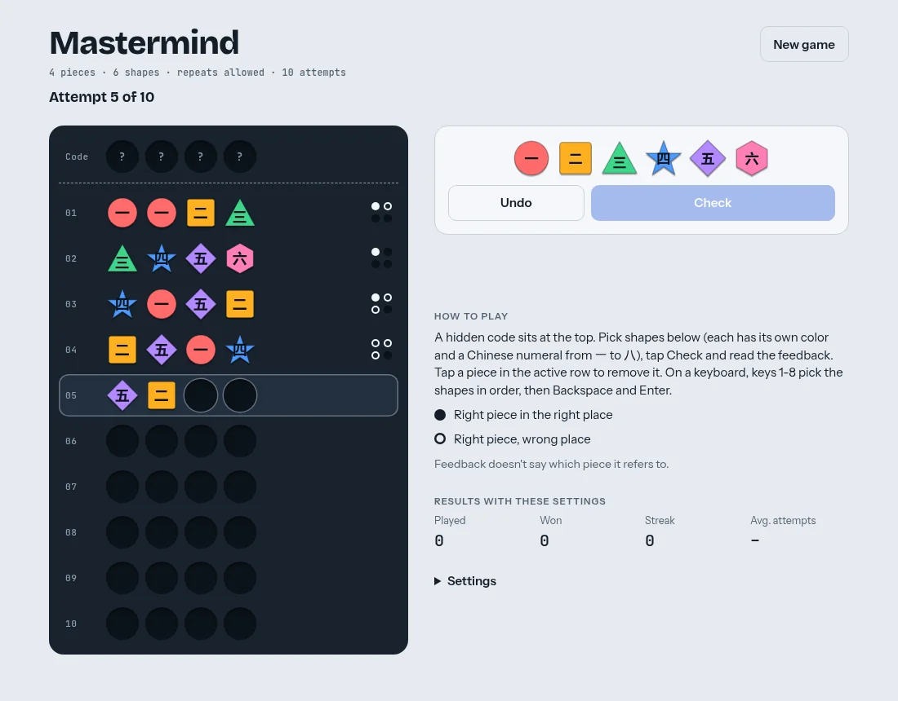

# Mastermind

Browser Mastermind code-breaking game. Single HTML file, no build step.

**Play:** https://alex27riva.github.io/mastermind/

- 4 or 5 pieces, 6 or 8 shapes, 8/10/12 attempts, optional repeats
- Keyboard: `1`–`8` pick shapes, `Backspace` undo, `Enter` check
- Stats saved locally per settings combo

## License

[MIT](LICENSE)
